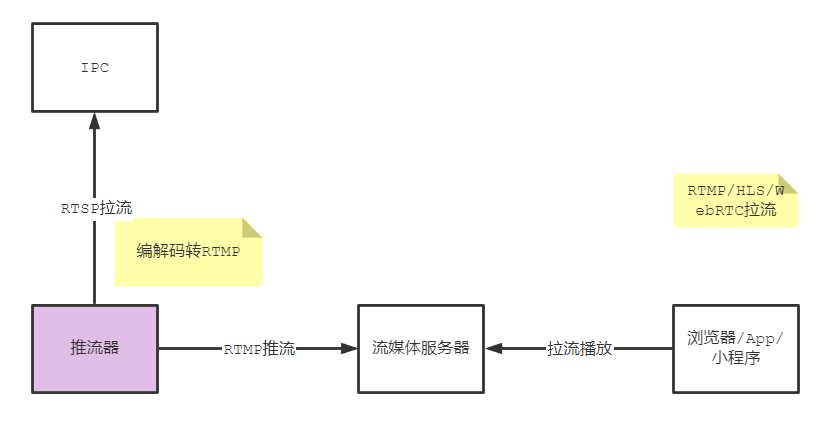
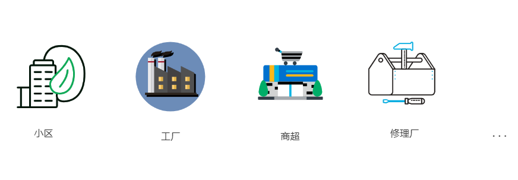
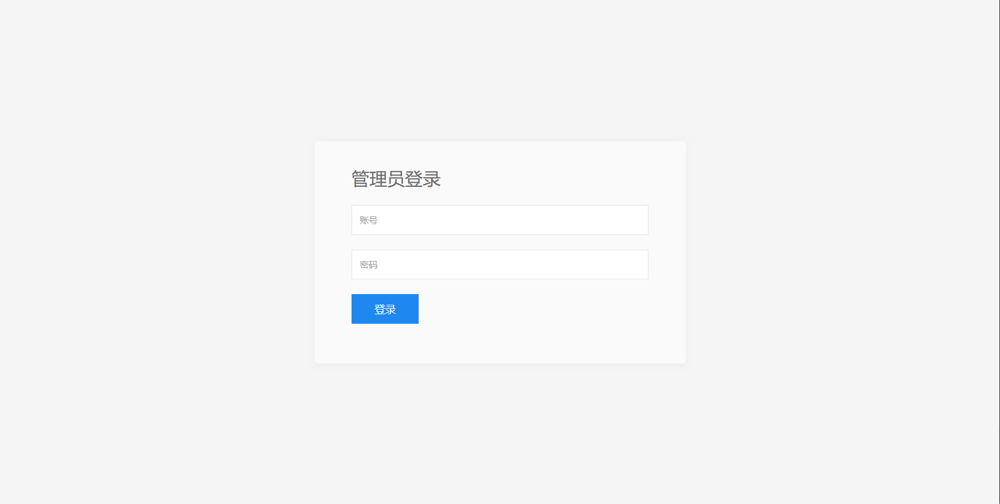
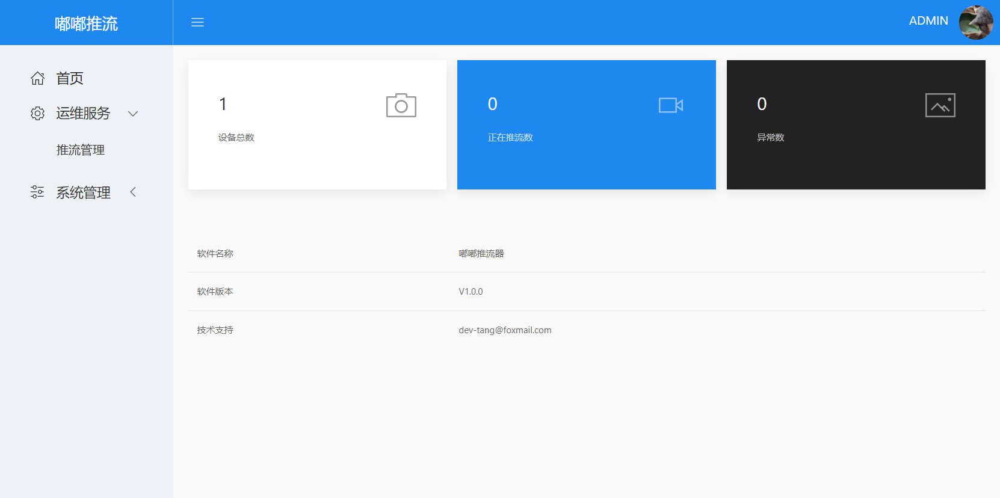
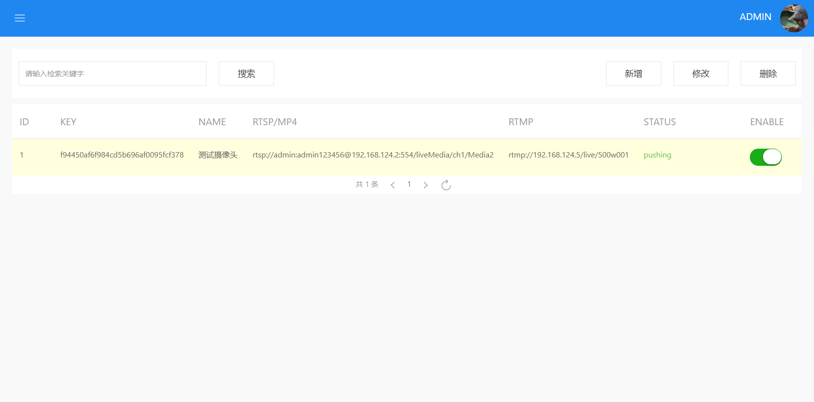
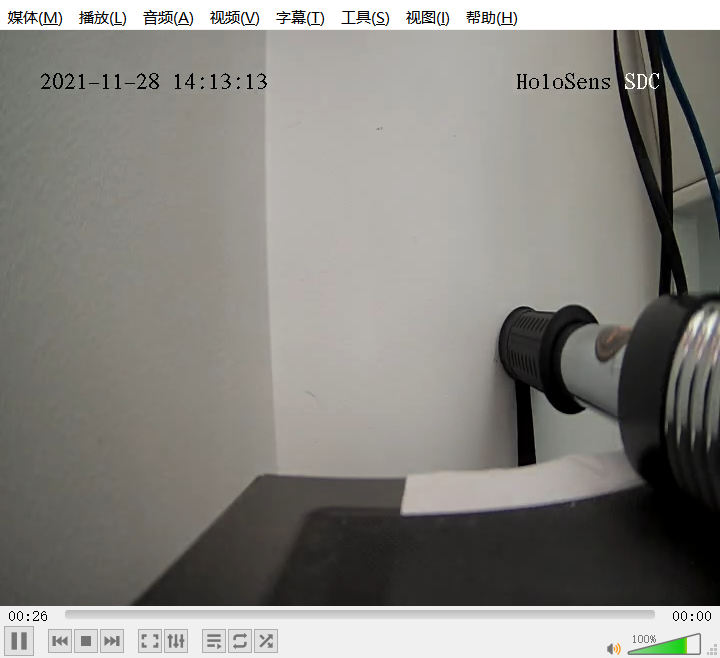

# 嘟嘟推流

## 一、概述

嘟嘟推流是基于Rust语言编写的IPC推流应用系统，主要目的是将内网摄像头视频流推送到云端的流媒体服务器，实现外网查看监控的目的。



## 二、应用场景

智慧小区、智能安防、工厂、商超、修理厂等有摄像头的场景。



## 三、效果预览

嘟嘟推流本身是一个服务端程序，只提供 `http`接口，下面的预览效果是结合前端项目的运行效果。前端源代码地址：https://gitee.com/dev-tang/dudu-admin

**登录**



**主页**



**推流列表**



**VLC播放**



## 四、编译

编译项目代码需要一些前置条件：必须先安装好 `rust` 和 `ffmpeg` 环境。然后配置好 `FFMPEG_PKG_CONFIG_PATH` 后才能开始编译。

1、克隆本项目代码

``` shell
git clone https://gitee.com/dev-tang/dudu.git
cd dudu
```

2、使用cargo编译并运行

``` shell
cargo build --quiet && target/debug/dudu
```


## 五、第三方接入

嘟嘟推流采用前后端分离架构，想将推流程序接入自己系统，只要运行服务端程序，然后通过 `http api` 进行调用即可。


## 六、注意事项

嘟嘟推流只是个人学习作品、暂未在商业项目中使用，其稳定性有待验证，如要使用请谨慎考虑。
